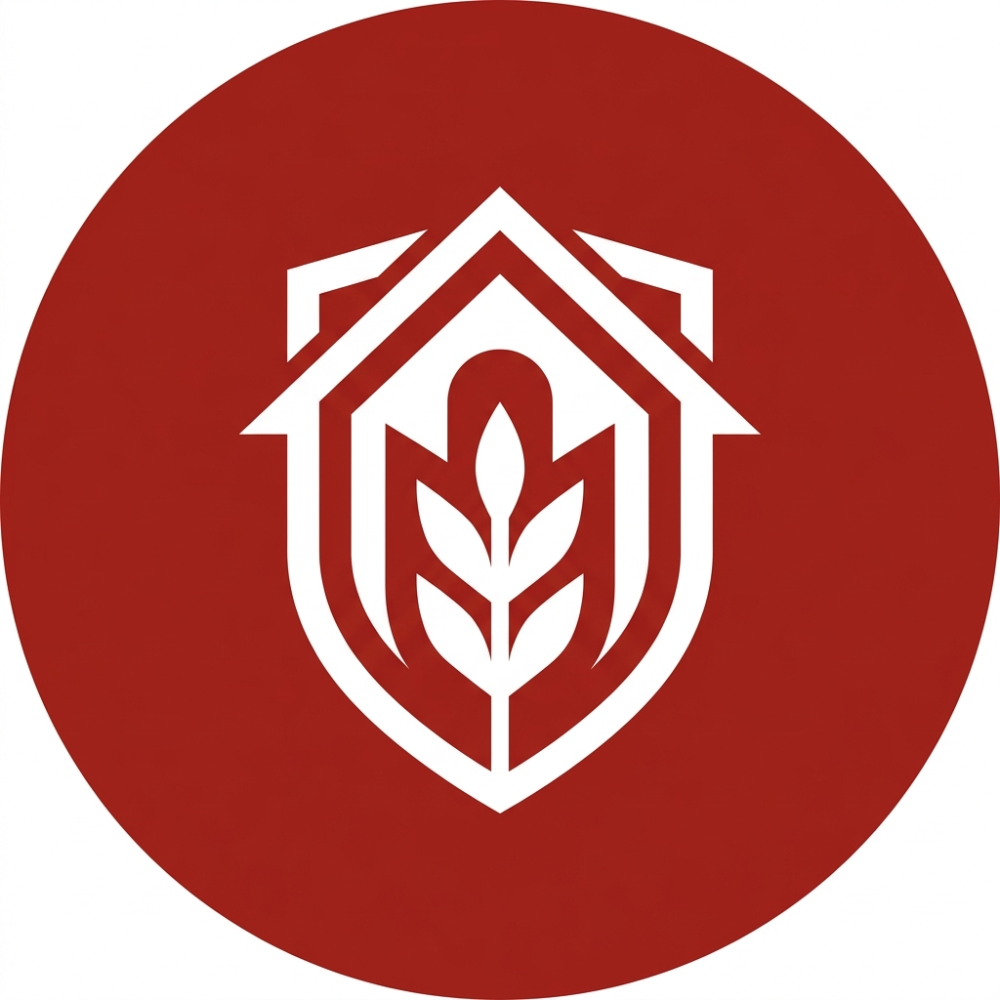

# KDKMP Digital Engine (Koperasi Desa Merah Putih)

KDKMP Digital adalah sebuah **Super-App Ekosistem Koperasi Desa** berbasis Laravel 11. Sistem ini mengintegrasikan E-Commerce Ritel, Layanan Finansial Mikro, Manajemen Komoditas Agro-GIS, dan Komunitas Warga ke dalam satu platform digital yang tangguh, aman, dan berdesain premium.



## 🚀 Ekosistem Fitur Utama

### 1. 🛍️ Ritel & E-Commerce (P2P & Koperasi)
- **POS Kasir Offline-Ready**: Antarmuka kasir modern dengan integrasi *barcode scanner* dan cetak struk termal.
- **Katalog Gerai Online**: Anggota dapat berbelanja sembako dan kebutuhan harian secara mandiri melalui aplikasi.
- **Warung Antar Warga (P2P)**: Marketplace mini di dalam aplikasi yang memungkinkan sesama anggota desa saling berjual-beli produk rumahan.

### 2. 🏦 Layanan Finansial (Simpan Pinjam)
- **Simpanan & Pinjaman**: Manajemen otomatis Simpanan Wajib, Pokok, dan Sukarela. Pengajuan pinjaman mikro dengan *underwriting* transparan.
- **Autodebet Cerdas**: Pemotongan otomatis iuran wajib bulanan dari saldo sukarela anggota.
- **Kalkulator SHU**: Perhitungan pembagian Sisa Hasil Usaha (SHU) secara proporsional dan otomatis berbasis poin loyalitas.

### 3. 🚜 Modul Agro-GIS & Forecasting
- **Pemetaan Lahan**: Pendataan lahan tani anggota (luas dan komoditas).
- **Estimasi Panen**: Kalkulasi prediktif hari menuju panen dan estimasi kuantitas hasil bumi (Data-driven via database).
- **Penyerapan Panen**: Fasilitas pembelian hasil panen dari petani dengan harga yang terstandardisasi.

### 4. 💳 Pembayaran & Loyalitas
- **Simulated Payment Gateway**: Integrasi simulasi QRIS Desa dan Virtual Account dengan dukungan penerimaan *Webhook* asinkron.
- **Program Loyalitas Berjenjang (Tiering)**: Sistem tier keanggotaan otomatis (Silver, Gold, Platinum) berbasis poin dengan potongan harga/diskon keranjang otomatis.
- **Database-Driven Vouchers**: Sistem kupon promo yang dapat dibatasi per pengguna untuk menghindari eksploitasi.

### 5. 📱 Progressive Web App (PWA) & UI Premium
- **Installable PWA**: Dapat diinstal sebagai aplikasi di Android/iOS dengan dukungan mode *Offline Fallback*.
- **Premium Glassmorphism UI**: Antarmuka bergaya *modern-glassmorphism*, efek *3D hover*, dan animasi mulus yang memberikan *feel* aplikasi korporat kelas atas.

## 🛠️ Arsitektur & Keamanan Enterprise-Grade
- **Pessimistic Locking**: Mencegah kerugian finansial akibat *Race Condition* (*Double-spend*) saat transaksi kasir dan autodebet massal.
- **Query Optimization & Caching**: Penggunaan `Cache::remember` untuk mengamankan *database* dari ledakan *query* (N+1) pada dashboard analitik 12-bulan.
- **Strict Tenant Isolation**: Mencegah kerentanan *Insecure Direct Object Reference (IDOR)* pada ekspor data (Excel/PDF) antar cabang/desa.
- **Audit Activity Log**: Perekaman aktivitas krusial (*Audit Trail*) secara otomatis untuk transparansi pengurus.

---

## 💻 Panduan Instalasi & Deployment

1. **Clone Repositori**:
   ```bash
   git clone https://github.com/kdkmp/kdkmp-digital.git
   cd kdkmp-digital
   ```

2. **Setup Environment**:
   ```bash
   cp .env.example .env
   composer install
   php artisan key:generate
   ```

3. **Konfigurasi Database & Webhook**:
   Sesuaikan `DB_*` di dalam file `.env`. 
   Tambahkan `FONNTE_TOKEN=rahasia-webhook-anda` untuk mengamankan *endpoint* pembayaran.

4. **Migrasi, Seeding & Eksekusi**:
   ```bash
   # Jalankan migrasi dan data awal komoditas/admin
   php artisan migrate --seed

   # (Opsional) Jalankan Stress Test untuk mengisi jutaan data simulasi
   # php artisan db:seed --class=StressTestSeeder

   # Jalankan server
   php artisan serve
   ```

5. **Deployment Optimization (Production)**:
   Sebelum *go-live* di server produksi (seperti VPS Ubuntu/Nginx), wajib jalankan perintah berikut untuk mengaktifkan *cache* Laravel:
   ```bash
   composer install --optimize-autoloader --no-dev
   php artisan config:cache
   php artisan route:cache
   php artisan view:cache
   ```

## 🧪 Pengujian Otomatis (TDD)
Aplikasi dilengkapi dengan serangkaian pengujian (*Feature/Unit Tests*) untuk menjaga stabilitas:
```bash
php artisan test
```

---
**Dibangun dengan ⚡ oleh AI Agent untuk Kesejahteraan Koperasi Desa Merah Putih.**
© 2026 KDKMP Digital.
